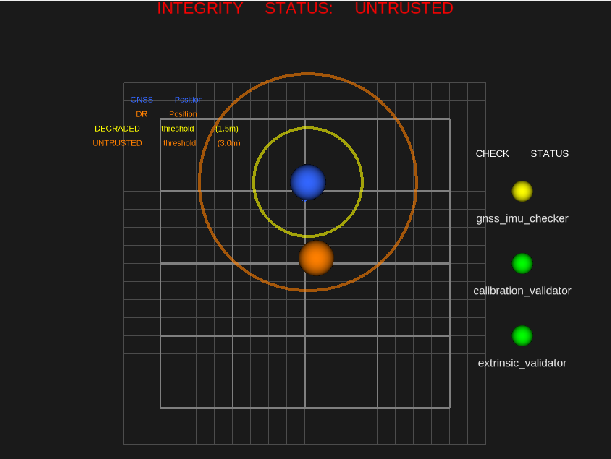

# POISE — Position and Orientation Integrity Supervision Engine

> **Phase 4** · ROS2 Humble · Python · Autoware-compatible

POISE monitors the trustworthiness of an autonomous vehicle's localization
solution by cross-checking independent sensor sources against each other and
publishing a system-level integrity state that a supervisory controller can
act on.



---

## Demo

The screenshot above shows POISE running the `gnss_drift` scenario in RViz2.
The blue sphere represents the GNSS position drifting northward from the map
origin at 0.1 m/s, dragging the yellow and orange divergence circles with it,
while the orange dead-reckoning sphere stays near the origin.  As the
separation crosses the 1.5 m threshold the system transitions TRUSTED →
DEGRADED → UNTRUSTED, shown in red at the top of the view.  The traffic-light
panel on the right displays per-checker fault status in real time.

---

## Motivation — The Localization Integrity Problem

Autonomous vehicles rely on a fused localization estimate (GNSS + IMU + LiDAR)
to navigate safely.  Sensor fusion algorithms produce a single "best estimate"
that appears smooth and confident — even when one or more inputs are faulty.
A jump, drift, or outage in GNSS may not be visible in the fused output until
the vehicle has deviated significantly from its intended path.

POISE adds a **supervision layer** that watches the raw sensor streams
independently, detects disagreements, and raises integrity alarms before the
fault propagates into the vehicle's control loop.

---

## Architecture

```
 ┌──────────────────────────────────────────────────────────────────────────┐
 │                           POISE Phase 3                                  │
 │                                                                          │
 │  ┌──────────────────┐    /sim/gnss     ┌────────────────────────────┐    │
 │  │  gnss_publisher  │ ─────────────→   │                            │    │
 │  │  (sim node)      │  SENSOR_QOS      │    gnss_imu_checker        │    │
 │  └──────────────────┘                  │    (cross-check)           │    │
 │                                        │  • DR integration          │    │
 │  ┌──────────────────┐    /sim/imu      │  • Cov / sat check         │    │
 │  │  imu_publisher   │ ──────────────→  │  • Dropout detection       │    │
 │  │  (sim node)      │  SENSOR_QOS   ↗  │  • recoverable flag        │    │
 │  └──────────────────┘               │  └────────────┬───────────────┘    │
 │                                     │               │                    │
 │  ┌──────────────────┐  /sim/vehicle_state           │                    │
 │  │ vehicle_state_   │ ──────────────┐               │                    │
 │  │ publisher        │  SENSOR_QOS   │               │                    │
 │  └──────────────────┘               │               │                    │
 │                                     │  ┌────────────▼───────────────┐    │
 │                    /sim/gnss ────────┼→ │  calibration_validator     │    │
 │                    /sim/imu ─────────┘  │  • IMU envelope (accel,    │    │
 │                                     ↘  │    gyro, gravity Z)        │    │
 │                                        │  • GNSS covariance         │    │
 │                                        │  • Geofence check          │    │
 │                                        │  • Fix type check          │    │
 │                                        └────────────┬───────────────┘    │
 │                                                     │                    │
 │  /sim/imu ─────────────────────────────┐            │                    │
 │  /sim/vehicle_state ───────────────────┼→ ┌─────────▼───────────────┐    │
 │                                        │  │  extrinsic_validator    │    │
 │                                        │  │  • Stationary gravity   │    │
 │                                        │  │    mean check           │    │
 │                                        │  │  • Mount shift detect   │    │
 │                                        └─ └─────────┬───────────────┘    │
 │                                                     │                    │
 │                              /poise/integrity_status (INTEGRITY_QOS)     │
 │                          ┌──────────────────────────┘                    │
 │                          ▼                                                │
 │                ┌─────────────────────┐                                   │
 │                │ integrity_aggregator│                                   │
 │                │                     │                                   │
 │                │  TRUSTED ←──────┐   │                                   │
 │                │    ↓ any WARN    │   │                                   │
 │                │  DEGRADED        │ revalidation                         │
 │                │    ↓             │   │                                   │
 │                │  UNTRUSTED ──────┘   │                                   │
 │                │  (reset via service) │                                   │
 │                └──────┬──────────────┘                                   │
 │                       │ /poise/system_integrity  /poise/reset            │
 │                       │ /poise/integrity_status  + JSONL log             │
 │                       │                                                   │
 │          /sim/gnss ───┼──────────────────────────────────┐               │
 │  /poise/dr_position ──┼──────────────────────────┐       │               │
 │                       ▼                          ▼       ▼               │
 │                ┌──────────────────────────────────────────────┐          │
 │                │            status_visualizer                 │          │
 │                │  Translates integrity state to RViz2 markers │          │
 │                │  • Trust state text  • Traffic-light panel   │          │
 │                │  • GNSS/DR position spheres and trails       │          │
 │                │  • Divergence threshold circles (1.5/3.0 m)  │          │
 │                │  • Reference grid  • Legend                  │          │
 │                └───────────────────┬──────────────────────────┘          │
 │                                    │ /poise/viz/*                        │
 │                                    ▼                                     │
 │                             ┌────────────┐                               │
 │                             │   RViz2    │  (poise.rviz config)          │
 │                             └────────────┘                               │
 └──────────────────────────────────────────────────────────────────────────┘
```

---

## Check Definitions

Phase 3 adds five new classified fault codes to the four introduced in Phase 2.

### Phase 2 Checks (gnss_imu_checker)

| Fault Code | Severity | Recoverable | Trigger |
|---|---|---|---|
| `GNSS_DROPOUT` | WARN | **Yes** | No GNSS fix for > `gnss_dropout_timeout_s` (2 s) |
| `GNSS_HIGH_COVARIANCE` | WARN | **Yes** | Reported covariance > `max_covariance_m2` (25 m²) |
| `GNSS_LOW_SATELLITES` | WARN | **Yes** | NavSatFix status indicates no fix |
| `GNSS_IMU_DIVERGENCE_WARN` | WARN | **No** | GNSS/IMU divergence > `warn_threshold_m` (1.5 m) |
| `GNSS_IMU_DIVERGENCE_CRITICAL` | CRITICAL | **No** | GNSS/IMU divergence > `critical_threshold_m` (3.0 m) |

### Phase 3 Checks — Calibration Envelope Validator

| Fault Code | Severity | Recoverable | Trigger |
|---|---|---|---|
| `IMU_ACCEL_OUT_OF_ENVELOPE` | CRITICAL | **No** | Linear acceleration magnitude > `imu_max_linear_accel` (49 m/s²) |
| `IMU_GYRO_OUT_OF_ENVELOPE` | CRITICAL | **No** | Angular velocity magnitude > `imu_max_angular_velocity` (10 rad/s) |
| `IMU_GRAVITY_OUT_OF_ENVELOPE` | CRITICAL | **No** | Z-axis accel outside [`imu_min_accel_z`, `imu_max_accel_z`] (−15 to −5 m/s²) |
| `GNSS_OUT_OF_GEOFENCE` | WARN | **Yes** | Position outside configured operating area |
| `GNSS_FIX_DEGRADED` | WARN | **Yes** | NavSatFix status below `gnss_min_fix_type` |

**Calibration envelope threshold rationale:**
- `imu_max_linear_accel = 49.0 m/s²` (~5G): the physical saturation limit of a typical MEMS accelerometer.  A stationary vehicle with gravity (≈9.81 m/s²) and normal vibration sits well below this.  Exceeding it requires an impossible mechanical event or sensor failure.
- `imu_max_angular_velocity = 10.0 rad/s`: a rapid vehicle U-turn peaks at ~1.5 rad/s; 10 rad/s is mechanically implausible and indicates sensor failure or electrical interference.
- `imu_gravity_z_range = [−15.0, −5.0] m/s²`: nominal gravity is −9.81 m/s² in Z-down body frame.  The ±5 m/s² tolerance covers vehicle pitch/roll up to ~30° while still flagging catastrophic mounting errors or orientation failures.

### Phase 3 Checks — Extrinsic Consistency Validator

| Fault Code | Severity | Recoverable | Trigger |
|---|---|---|---|
| `IMU_EXTRINSIC_WARN` | WARN | **No** | Mean Z-axis gravity deviation > `imu_gravity_warn_tolerance` (0.5 m/s²) |
| `IMU_EXTRINSIC_CRITICAL` | CRITICAL | **No** | Mean Z-axis gravity deviation > `imu_gravity_critical_tolerance` (1.5 m/s²) |

**Extrinsic detection method — systematic vs. random offset:**

A physical mount rotation shifts the IMU's gravity vector by a *constant* amount on every sample.  This is a **systematic** offset that shifts the mean of the Z-axis distribution but does not increase its variance.  A standard per-sample threshold check would produce false alarms from random noise (typically ±0.02 m/s² at 1σ).

The extrinsic validator uses a **rolling window mean** (100 samples, 1 s at 100 Hz).  Averaging 100 samples reduces Gaussian noise by √100 = 10×, giving:
- Sensitivity to systematic offsets ≥ ~0.05 m/s² (~0.3° tilt)
- Near-zero false positive rate from random noise alone

The deviation of the mean from `expected_gravity_z` (−9.81 m/s²) is the diagnostic signal:

| Deviation | Interpretation | Action |
|---|---|---|
| < 0.5 m/s² | Within calibration tolerance (< ~3° tilt equivalent) | STATUS_OK |
| 0.5–1.5 m/s² | Detectable systematic offset (~3°–9° tilt) | IMU_EXTRINSIC_WARN |
| > 1.5 m/s² | Significant offset affecting DR accuracy (> ~9° tilt) | IMU_EXTRINSIC_CRITICAL |

**Extrinsic check and tunnel / standstill interaction:**

The check only runs when the vehicle is stationary (velocity < `stationary_velocity_threshold`, default 0.5 m/s).  This prevents vehicle acceleration from being misinterpreted as a gravity shift.

- **Vehicle moving**: accumulation pauses; last determined status is held and re-published at 1 Hz.
- **Moving → stationary transition**: sample window resets so fresh samples are used.
- **Before min_stationary_samples (50) collected**: publishes `EXTRINSIC_CHECK_PENDING` (STATUS_OK) while waiting.

**Known limitation:** The extrinsic check assumes level terrain.  A sustained road slope will produce an apparent gravity deviation.  In a production deployment, terrain gradient (from a map or barometer) should be compensated before this check runs.

---

## Trust State Machine (Phase 3)

```
         ┌───────────┐
   start →│  TRUSTED  │◄──────────────────────────────┐
         └─────┬─────┘                                │
               │ any WARN                              │ revalidation
               ▼                                      │ complete
         ┌───────────┐                                │
         │ DEGRADED  │────────────────────────────────┤
         └─────┬─────┘                                │
               │ CRITICAL | 2× WARNs                  │
               │ | non-recoverable WARN > timeout      │
               ▼                                      │
         ┌───────────┐                                │
         │ UNTRUSTED │────── /poise/reset ────────────┘
         └───────────┘  (accepted when no active faults)
```

### Recovery Rules

| Scenario | Behaviour |
|---|---|
| All active faults are **recoverable** and they clear | Start `revalidation_period_s` (10 s) timer; if no new faults → TRUSTED |
| Any **non-recoverable** fault was active | Auto-recovery blocked; operator must call `/poise/reset` |
| New fault arrives during revalidation | Revalidation timer restarted |
| Recoverable fault arrives while non-recoverable is active | Escalate to UNTRUSTED (potential masking attempt) |

### `/poise/reset` Service

```bash
ros2 service call /poise/reset std_srvs/srv/Trigger
```

- **Accepted** when no fault conditions are currently active.
- **Rejected** if any check is still in WARN or CRITICAL.
- Clears non-recoverable fault history; returns to TRUSTED.
- Every attempt (accepted or rejected) is logged to the JSONL file.

---

## Fault Injection Usage

Fault scenarios are selected at launch time using the `scenario:=` argument
(see [Scenarios](#scenarios) above).  For custom fault combinations, the
underlying parameters in `config/sim_config.yaml` can also be edited directly.

### GNSS Fault Modes

```yaml
gnss_publisher:
  ros__parameters:
    fault_mode: drift        # none | drift | jump | dropout | covariance_inflation
    drift_rate_m_per_s: 0.05
    drift_direction_deg: 0.0
    jump_time_s: 20.0
    jump_north_m: 5.0
    initial_latitude: 34.0  # outside geofence [35.0, 36.5] → GNSS_OUT_OF_GEOFENCE
```

### IMU Fault Modes

```yaml
imu_publisher:
  ros__parameters:
    fault_mode: spike        # none | bias | spike | dropout
    spike_time_s: 10.0
    spike_magnitude_mps2: 55.0   # > 49.0 → IMU_ACCEL_OUT_OF_ENVELOPE

    extrinsic_shift: 2.0         # always applied; 2.0 > crit_tol 1.5 → IMU_EXTRINSIC_CRITICAL
```

---

## Scenarios

POISE ships with seven pre-defined fault scenarios selectable at launch time.
No config file editing is required.

```bash
ros2 launch poise poise.launch.py scenario:=<name>
```

| Scenario | Description |
|---|---|
| `nominal` | No faults — all checks green, system holds TRUSTED |
| `gnss_drift` | GNSS drifts north at 0.1 m/s — triggers GNSS/IMU divergence warn then critical |
| `gnss_jump` | 4 m instantaneous GNSS displacement at t=15 s — instant CRITICAL |
| `gnss_dropout` | GNSS topic suppressed for 30 s from t=10 s — recoverable dropout, auto-recovery |
| `imu_bias` | Constant 0.8 m/s² accelerometer bias on X axis — corrupts dead-reckoning |
| `imu_spike` | 55 m/s² impulse at t=10 s — IMU envelope CRITICAL + DR corruption |
| `imu_extrinsic` | 2.0 m/s² Z-axis mount shift — extrinsic CRITICAL after stationary samples |

An unrecognised scenario name prints a clear error listing valid names and exits without starting any nodes.

---

## Build and Run Instructions

### Prerequisites

- Ubuntu 22.04
- ROS2 Humble (`sudo apt install ros-humble-desktop`)
- `colcon` build tool

### 1 — Build

```bash
cd ~/projects   # parent of the poise/ repo root
source /opt/ros/humble/setup.bash
colcon build --packages-select poise
```

### 2 — Verify entry points

```bash
source install/setup.bash
ros2 pkg executables poise
# Expected:
#   poise calibration_validator
#   poise extrinsic_validator
#   poise gnss_imu_checker
#   poise gnss_publisher
#   poise imu_publisher
#   poise integrity_aggregator
#   poise status_visualizer
#   poise vehicle_state_publisher
```

### 3 — Launch

```bash
# Nominal (no faults) — opens RViz2 with live integrity visualization
ros2 launch poise poise.launch.py

# With a fault scenario
ros2 launch poise poise.launch.py scenario:=gnss_drift
ros2 launch poise poise.launch.py scenario:=imu_spike
```

### 4 — Verify topics

```bash
source /opt/ros/humble/setup.bash && source install/setup.bash
ros2 topic list
# Should include:
#   /sim/gnss
#   /sim/imu
#   /sim/vehicle_state
#   /poise/integrity_status
#   /poise/system_integrity
```

### 5 — Phase 3 Verification Tests

**Test A — Nominal (no faults):**
Default config.  All three checkers publish STATUS_OK, system holds TRUSTED.

**Test B — GNSS geofence (recoverable, auto-recovery):**
```yaml
gnss_publisher:
  ros__parameters:
    initial_latitude: 34.0   # outside geofence [35.0, 36.5]
```
Expected: `GNSS_OUT_OF_GEOFENCE` WARN → DEGRADED.
Restore latitude → revalidation → TRUSTED (auto-recovery, no reset needed).

**Test C — IMU acceleration spike (non-recoverable):**
```yaml
imu_publisher:
  ros__parameters:
    fault_mode: spike
    spike_magnitude_mps2: 55.0   # exceeds 49.0 m/s² envelope limit
```
Expected: `IMU_ACCEL_OUT_OF_ENVELOPE` CRITICAL at t≈10 s → UNTRUSTED.
Does NOT auto-recover.  Requires `/poise/reset` after fault clears.

**Test D — IMU extrinsic shift (non-recoverable):**
```yaml
imu_publisher:
  ros__parameters:
    extrinsic_shift: 2.0     # 2.0 m/s² > critical_tolerance 1.5 m/s²
```
Expected: `IMU_EXTRINSIC_CRITICAL` after ~1 s of stationary samples → UNTRUSTED.
Does NOT auto-recover.  Requires `/poise/reset`.

### 6 — GNSS drift test (Phase 1/2 reference)

```yaml
gnss_publisher:
  ros__parameters:
    fault_mode: drift
    drift_rate_m_per_s: 0.05
```
Expected: `GNSS_IMU_DIVERGENCE_WARN` after ~30 s, UNTRUSTED after ~35 s.

### 7 — Reset after non-recoverable faults

```bash
ros2 service call /poise/reset std_srvs/srv/Trigger
```

### 8 — Check the JSON log

```bash
cat /tmp/poise_integrity_log.jsonl | python3 -m json.tool --no-ensure-ascii
```

---

## Relationship to Autoware Universe

POISE is designed to monitor Autoware localization outputs.  The sim topics
can be remapped to Autoware's live topics using launch arguments:

| POISE sim topic | Autoware topic |
|---|---|
| `/sim/gnss` | `/sensing/gnss/ublox/nav_sat_fix` |
| `/sim/imu` | `/sensing/imu/tamagawa/imu_raw` |
| `/sim/vehicle_state` | `/localization/kinematic_state` |

To connect to a live Autoware stack, replace the sim publisher nodes with
remapping-only launch entries:

```python
Node(
    package='poise',
    executable='gnss_imu_checker',
    remappings=[
        ('/sim/gnss', '/sensing/gnss/ublox/nav_sat_fix'),
        ('/sim/imu',  '/sensing/imu/tamagawa/imu_raw'),
    ],
),
Node(
    package='poise',
    executable='extrinsic_validator',
    remappings=[
        ('/sim/imu',           '/sensing/imu/tamagawa/imu_raw'),
        ('/sim/vehicle_state', '/localization/kinematic_state'),
    ],
),
```

---

## See Also

- [`docs/safety_concept.md`](docs/safety_concept.md) — Formal safety rationale,
  failure mode analysis, and known limitations
